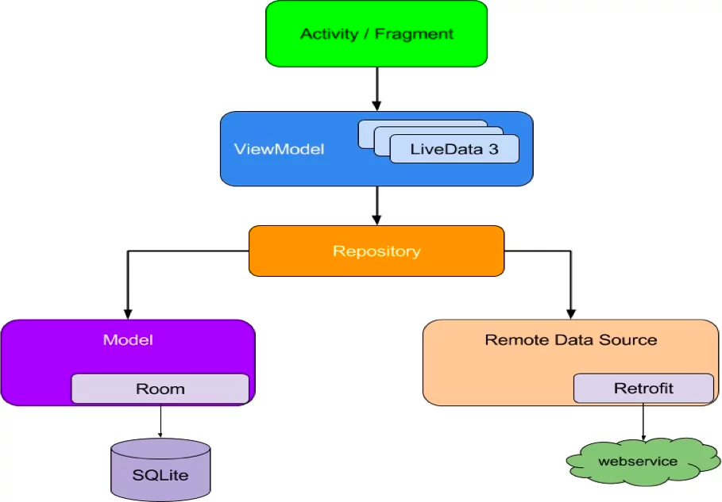

# Mercado Libre Challenge
This is a simple project created to demonstrate some of the skills that I have, in this project I decided to create a classic architecture mvvm that allows to develop this app

in this architecture the business logic is decoupled from the user interface and is easier to maintain and test. components can be reused. System maintenance is simplified.

## Screens

- recent searches
- Search 
- product detail

## Tech

For this project I use the following technologies:

- [RXJava] : <https://github.com/ReactiveX/RxAndroid>
- [Retrofit] : <https://square.github.io/retrofit>
- [Dagger 2] : <https://dagger.dev/dev-guide/android.html>
- [Epoxy] : <https://github.com/airbnb/epoxy>
- [Navigation Component] : <https://developer.android.com/guide/navigation>
- [ViewModel] : <https://developer.android.com/topic/libraries/architecture/viewmodell>
- [Glide] : <https://github.com/bumptech/glide>
- [Mockito] : <https://site.mockito.org>

